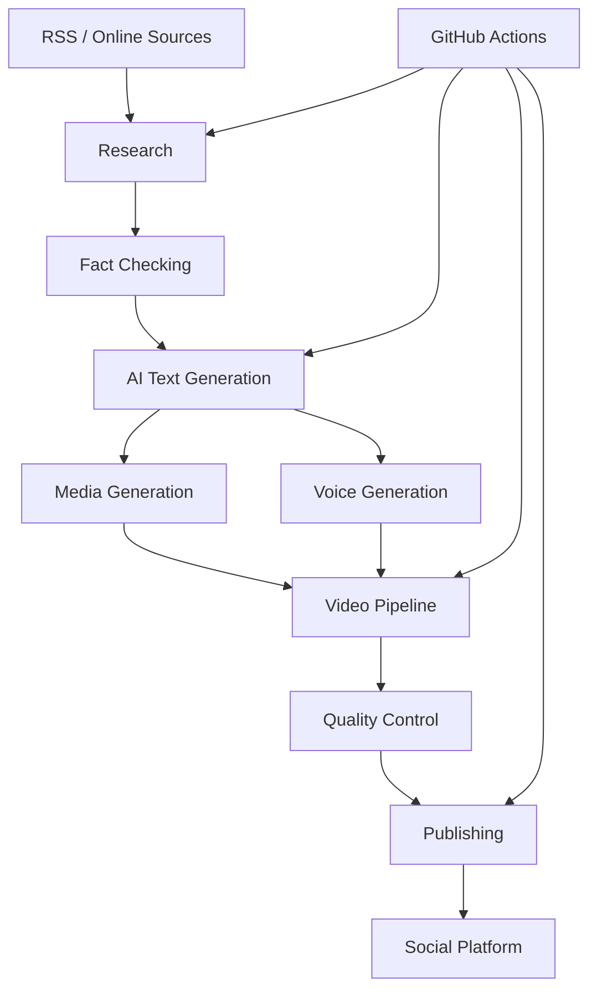

# OnC — One Click Content

> **Automated AI-Powered Content Generation & Publishing System**  
> *Powered by AI, Built for Automation*

[](https://www.python.org/downloads/)
[](LICENSE)
[](https://github.com/features/actions)
[](https://github.com/psf/black)

---

## 📌 About OnC

**OnC (One Click Content)** is an automated content generation and publishing system designed to automate the complete content workflow — from research and generation to media creation, quality control and publishing.

OnC combines:

- AI providers
- RSS and online sources
- Fact-checking
- Image generation and retrieval
- Voice generation
- Video generation
- Video editing
- Quality control
- Social media publishing
- GitHub Actions automation

The system is designed to be configurable so that each user can adapt it to their own content strategy, services and infrastructure.

---

## 🎯 Core Mission

OnC aims to automate repetitive content-production tasks while keeping the workflow configurable and reliable.

### Main objectives

- **Automate** content creation from research to publishing.
- **Reduce manual work** through configurable workflows.
- **Improve reliability** with provider fallbacks.
- **Verify information** using external sources and fact-checking.
- **Generate multimedia content** including images, audio and video.
- **Automate recurring tasks** with GitHub Actions.
- **Allow users to adapt the system** to their own projects and businesses.

---

# ✨ Features

## 📰 Automated Content Generation

OnC can automate several stages of the content creation process:

| Feature | Description |
|---|---|
| **Text Generation** | Generate content using configurable AI providers |
| **Image Content** | Generate or retrieve images for publications |
| **Multi-Format Content** | Support different content formats |
| **Fact-Checking** | Verify information using external sources |
| **RSS Integration** | Retrieve information from configured RSS feeds |
| **AI Video Pipeline** | Generate videos from scripts, audio and visual assets |
| **Quality Control** | Validate generated media before publishing |
| **Automated Publishing** | Publish generated content through supported platforms |
| **Scheduled Automation** | Run recurring workflows through GitHub Actions |

---

# 🤖 AI Provider System

OnC can use multiple AI providers through a configurable fallback system.

The purpose of the fallback architecture is to improve availability when a provider:

- reaches its rate limit;
- becomes temporarily unavailable;
- returns an error;
- or cannot process a request.

### Text Generation

Example provider chain:

```text
Mistral
   ↓
Together
   ↓
Gemini
   ↓
Hugging Face
```

### Image Generation

OnC can also use multiple image providers depending on the configured workflow.

Example:

```text
Primary Provider
       ↓
Secondary Provider
       ↓
Fallback Provider
       ↓
Final Fallback
```

> ⚡ Provider availability depends on the APIs, models, accounts and quotas available to the user.

---

# 📡 RSS & Research

OnC can retrieve information from configured RSS feeds and online sources.

RSS sources can be configured according to the user's own needs.

Examples of possible sources include:

- Technology
- Science
- News
- Education
- Business
- Entertainment
- Specialized publications

The user is responsible for selecting appropriate sources and respecting their terms of use.

---

# 🔎 Fact-Checking

OnC includes a fact-checking workflow designed to verify information before publication.

A typical workflow is:

```text
Topic
  ↓
Research
  ↓
Source extraction
  ↓
Claim verification
  ↓
Cross-checking
  ↓
Validation
  ↓
Content generation
```

Fact-checking improves reliability but **does not guarantee that generated content is always correct**.

Human verification may still be required.

---

# 🎥 AI Video Pipeline

OnC includes a modular video-generation pipeline.

```text
RSS / Research
      ↓
Script Generation
      ↓
Voice Generation
      ↓
Scene Analysis
      ↓
Visual Generation
      ↓
Animation
      ↓
Audio Mixing
      ↓
Video Assembly
      ↓
Quality Control
      ↓
Publishing
```

### Pipeline stages

```bash
# Step 1 — Generate the script
python video_pipeline/01_script.py

# Step 2 — Generate the voice
python video_pipeline/02_voice.py

# Step 3 — Analyze scenes
python video_pipeline/03_analyze.py

# Step 4 — Generate or retrieve visuals
python video_pipeline/04_visuals.py

# Step 5 — Animate visuals
python video_pipeline/05_animate.py

# Step 6 — Mix audio
python video_pipeline/06_audio.py

# Step 7 — Assemble the final video
python video_pipeline/07_editor.py

# Step 8 — Quality control
python video_pipeline/08_qc.py

# Step 9 — Publish
python video_pipeline/publish_video.py
```

---

# 🚀 Getting Started

## 📥 Requirements

Recommended environment:

- **Python 3.11+**
- **Git**
- **FFmpeg**
- **FFprobe**
- **ImageMagick**
- Internet connection
- Accounts/API keys required by the enabled providers
- GitHub account if GitHub Actions automation is used

Some workflows may require additional system dependencies.

---

# 🛠️ Installation

## 1. Clone the repository

```bash
git clone <YOUR_ONC_REPOSITORY_URL>
cd Nyavodroid-OnC
```

Replace `<YOUR_ONC_REPOSITORY_URL>` with the repository URL provided with your licensed copy.

---

## 2. Create a virtual environment

### Windows

```bash
python -m venv .venv
.venv\Scripts\activate
```

### Linux / macOS

```bash
python3 -m venv .venv
source .venv/bin/activate
```

---

## 3. Install Python dependencies

```bash
python -m pip install --upgrade pip
pip install -r requirements.txt
```

---

## 4. Verify FFmpeg

```bash
ffmpeg -version
```

Also verify FFprobe:

```bash
ffprobe -version
```

---

## 5. Verify ImageMagick

```bash
magick -version
```

If your installation uses the legacy command:

```bash
convert -version
```

---

# 🔐 Configuration

OnC uses environment variables for API credentials and configuration.

Create your local `.env` file from `.env.example` if provided:

```bash
cp .env.example .env
```

On Windows, copy the file manually if `cp` is unavailable.

**Never commit your real `.env` file to Git.**

---

# 🔑 Environment Variables

The exact variables depend on the features and providers enabled in your installation.

Typical variables may include:

## Social Media

```env
FB_PAGE_ID=your_page_id
FB_PAGE_ACCESS_TOKEN=your_page_access_token
```

## Text AI Providers

```env
GEMINI_API_KEY_CONTENT=your_key
MISTRAL_API_KEY=your_key
TOGETHER_API_KEY=your_key
HF_TOKEN=your_token
```

## Image Providers

```env
CLOUDFLARE_ACCOUNT_ID=your_account_id
CLOUDFLARE_API_TOKEN=your_api_token
FAL_API_KEY=your_token
REPLICATE_API_TOKEN=your_token
```

## Search & Verification

```env
TAVILY_API_KEY=your_key
PEXELS_API_KEY=your_key
```

> Only configure the providers you actually intend to use.

---

# 💻 Usage

## Manual Content Generation

Depending on the configured workflow:

```bash
python post_content.py
```

The workflow can generate content using the configured AI providers and publishing configuration.

---

# 🧪 Dry Run

When supported by the workflow, use dry-run mode before enabling real publishing.

Example:

```env
VIS_DRY_RUN=1
```

A dry run allows the user to test the workflow without performing the final publishing operation.

---

# ⚙️ GitHub Actions

OnC can use GitHub Actions to automate recurring workflows.

Typical workflow:

```text
GitHub Actions
      ↓
Scheduled Trigger
      ↓
OnC
      ↓
Research
      ↓
AI Generation
      ↓
Media Generation
      ↓
Quality Control
      ↓
Publishing
```

Before enabling automated publishing:

1. Configure GitHub repository secrets.
2. Configure the required API credentials.
3. Test the workflow manually.
4. Verify the generated content.
5. Enable the desired schedule.

---

# 🔒 Security

Never place secrets directly inside source code.

Do not commit:

```text
.env
API keys
Access tokens
Passwords
Private credentials
Facebook tokens
GitHub tokens
```

Use:

- `.env` for local development.
- GitHub Secrets for GitHub Actions.
- Secret-management solutions for production deployments.

If a secret is accidentally committed to Git history, immediately revoke it and generate a replacement.

---

# 📦 What the Buyer Receives

A commercial purchase of OnC provides the buyer with a licensed copy of the software source code and the associated materials included in the purchased package.

Depending on the purchased version, this may include:

- OnC source code
- Configuration templates
- Documentation
- Quick Start documentation
- Content-generation modules
- Fact-checking modules
- AI provider integrations
- Video-generation pipeline
- Quality-control components
- GitHub Actions workflows
- Supporting scripts included in the purchased release

The purchase **does not transfer ownership of the OnC intellectual property**.

The buyer receives a license to use the software according to the terms of the `LICENSE` file.

---

# 🔑 What the Buyer Must Provide

The buyer is responsible for providing their own external services and credentials.

This may include:

- AI provider accounts
- AI API keys
- Social media accounts
- Facebook Page credentials
- GitHub account
- Search API credentials
- Image API credentials
- Hosting or computing resources
- Internet access
- Third-party service subscriptions or fees

The seller does **not** provide personal API keys, personal access tokens or personal social-media accounts.

---

# 💰 Third-Party Services

OnC can interact with external services.

These services are independent from OnC.

Examples include:

- AI providers
- Search providers
- Image providers
- Facebook
- GitHub
- Pexels
- Tavily
- Cloudflare
- Hugging Face
- Other configured APIs

The user is responsible for:

- Creating their own accounts.
- Obtaining their own credentials.
- Paying applicable fees.
- Following provider terms of service.
- Respecting API quotas.
- Respecting applicable laws and platform policies.

OnC does not grant ownership or licensing rights to third-party services.

---

# ⚠️ AI Content Disclaimer

OnC may generate content using artificial intelligence.

AI-generated content may contain:

- Errors
- Inaccuracies
- Outdated information
- Misleading information
- Copyright-sensitive material
- Unexpected or inappropriate content

Users are responsible for reviewing generated content before publishing when appropriate.

OnC should not be relied upon without appropriate human verification for critical decisions.

---

# 📁 Project Structure

```text
Nyavodroid-OnC/
│
├── .github/
│   └── workflows/
│       └── *.yml
│
├── video_pipeline/
│   ├── 01_script.py
│   ├── 02_voice.py
│   ├── 03_analyze.py
│   ├── 04_visuals.py
│   ├── 05_animate.py
│   ├── 06_audio.py
│   ├── 07_editor.py
│   ├── 08_qc.py
│   ├── publish_video.py
│   └── config_video.py
│
├── tests/
│
├── assets/
│
├── .env.example
├── .gitignore
├── AGENTS.md
├── LICENSE
├── QUICKSTART.md
├── requirements.txt
├── requirements-dev.txt
└── *.py
```

> The exact structure may vary between releases.

---

# 🏗️ Architecture



---

# 🧪 Testing

Development dependencies are provided separately.

Install them with:

```bash
pip install -r requirements-dev.txt
```

Run the test suite:

```bash
pytest
```

Tests are intended to verify important components such as:

- Configuration loading
- Content generation
- Fact-checking
- Media processing
- Video pipeline components
- Utility functions

---

# 🤝 Contributions

OnC is distributed under a proprietary commercial license.

Unless explicitly authorized by the copyright holder, users may not redistribute the source code or publish modified versions.

For authorized development or collaboration, contact the copyright holder.

---

# 📜 License

## Commercial Proprietary License

OnC is **proprietary software**.

Commercial use is permitted for licensed users.

A licensed user may:

- Use OnC commercially.
- Run OnC on their own infrastructure.
- Modify OnC for their own use.
- Generate and publish content using OnC.
- Use OnC as part of their own business operations.

A licensed user may **NOT**:

- Resell OnC.
- Resell the source code.
- Redistribute the source code.
- Publish the source code publicly.
- Upload the source code to a public repository.
- Share the source code with third parties.
- Sublicense OnC.
- Sell modified versions of OnC.
- Distribute modified versions of OnC.
- Remove copyright or license notices.

The software remains the intellectual property of the copyright holder.

See [`LICENSE`](LICENSE) for the complete terms.

---

# 🙏 Acknowledgments

OnC may use or interact with technologies and services including:

- Python
- Pillow
- PyYAML
- Edge TTS
- FFmpeg
- ImageMagick
- Mistral
- Gemini
- Together
- Hugging Face
- Cloudflare
- Fal.ai
- Replicate
- Pexels
- Tavily
- GitHub Actions

All third-party technologies remain the property of their respective owners and are subject to their respective licenses and terms.

---

# 📞 Contact

**Author:** Nyavo Rakotomavo

**Email:** nyavosapp@gmail.com

**GitHub:**  
https://github.com/nyavorakotomavo

---

<p align="center">

**OnC — One Click Content**

Automate. Generate. Verify. Publish.

© 2026 Nyavo Rakotomavo — All Rights Reserved.

</p>